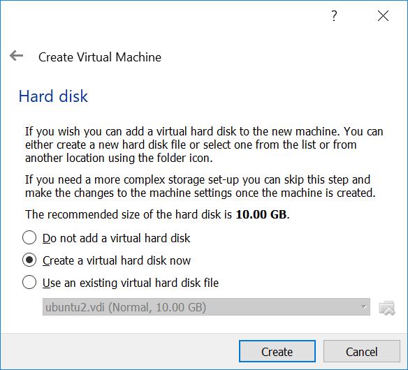
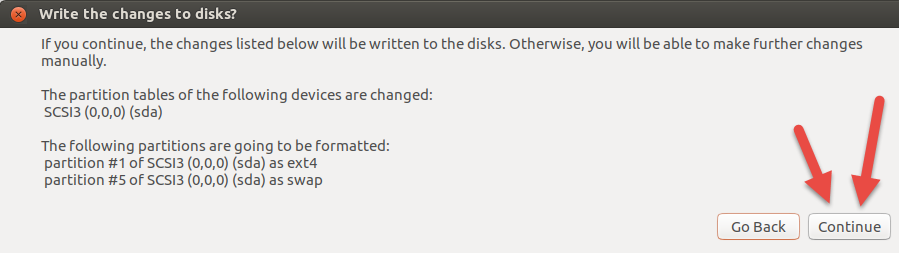
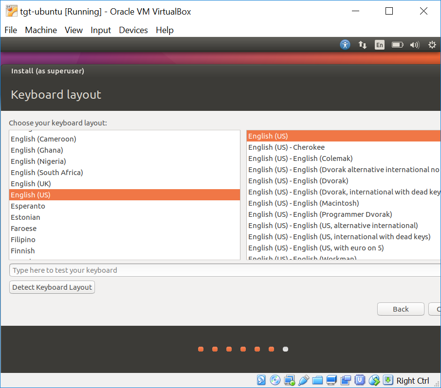

# hive-unit-testing
A framework for unit testing Hive scripts with HiveRunner.  This tool can be used by compiling the source and including in your Java project.

## HiveRunner Git Repo
If you want to explore HiveRunner, look at how the developers have tested it, look for examples, etc., you can check out their repo: https://github.com/klarna/HiveRunner

## Compatibility
This has been verified to work using IntelliJ Community Edition.

|Operating System|Compatibility|
|-------|-----|
|Windows|Must use a virtual machine with Linux installed.  See section below on installation|
|Unix|Works out-of-the-box|
|Mac OSX|Works out-of-the-box|


# Compiling Source
You can compile the source code using maven: `mvn clean test package`.  Once you've compiled the source, you can include the jar file in your project.

## Automatically Including This Framework Via Maven
This framework is not yet setup as a Maven repository, so you have to manually include the jars to your project.

# Examples in Framework
There are examples on how to write tests for Hive scripts in the /src/test/java/examples folder of the project.

|Hive Script|Test Class|
|-----|-----|
|src/test/resources/examples/create_database_generic.hql|CreateDatabaseGenericHqlTest|
|src/test/resources/examples/dc_test_table.hql|DcTestTableHqlTest|

# Naming Standards
Name the test class as the same as your HQL file, but using UpperCamelCase.  The purpose of this is to be able to quickly recognize which script is being tested by looking at the Java test class name.

The format is: `[FileName][FileExtension]Test`

**Example:** dc_test_table.hql --> DcTestTableHqlTest

# Using HiveRunner Without this Framework
If you don't wish to leverage the framework in this repo, you can include HiveRunner using the sample POM below as a start.

```xml
<?xml version="1.0" encoding="UTF-8"?>
<project xmlns="http://maven.apache.org/POM/4.0.0"
         xmlns:xsi="http://www.w3.org/2001/XMLSchema-instance"
         xsi:schemaLocation="http://maven.apache.org/POM/4.0.0 http://maven.apache.org/xsd/maven-4.0.0.xsd">
    <modelVersion>4.0.0</modelVersion>

    <groupId>com.rwbsystems</groupId>
    <artifactId>hive-unit-testing</artifactId>
    <version>1.0-SNAPSHOT</version>

    <dependencies>
        <dependency>
            <groupId>com.klarna</groupId>
            <artifactId>hiverunner</artifactId>
            <version>3.2.0</version>
        </dependency>
        <!--<dependency>-->
        <!--<groupId>org.junit.jupiter</groupId>-->
        <!--<artifactId>junit-jupiter-api</artifactId>-->
        <!--<version>RELEASE</version>-->
        <!--</dependency>-->
        <dependency>
            <groupId>junit</groupId>
            <artifactId>junit</artifactId>
            <version>4.12</version>
        </dependency>
        <dependency>
            <groupId>org.mockito</groupId>
            <artifactId>mockito-core</artifactId>
            <version>1.10.19</version>
        </dependency>
    </dependencies>

    <build>
        <plugins>
            <plugin>
                <groupId>org.apache.maven.plugins</groupId>
                <artifactId>maven-compiler-plugin</artifactId>
                <configuration>
                    <source>1.8</source>
                    <target>1.8</target>
                </configuration>
            </plugin>
            <plugin>
                <groupId>org.apache.maven.plugins</groupId>
                <artifactId>maven-surefire-plugin</artifactId>
                <version>2.20</version>
                <configuration>
                    <forkCount>1</forkCount>
                    <reuseForks>true</reuseForks>
                    <argLine>-Xmx2048m</argLine>
                </configuration>
            </plugin>
        </plugins>
    </build>
</project>
```

# Setting Up Windows for using HiveRunner
If you want to do Hive unit testing on Windows, you'll have to use a virtual machine.  The setup in this section will describe how to set up VirtualBox for unit testing development.

The following steps will guide you through the following:  
1. Download and install VirtualBox
1. Creating the virtual machine
1. Installing Ubuntu
1. Installing the VirtualBox Guest Additions
1. Mounting your shared Git folder
1. Installing Java
1. Installing IntelliJ
1. Opening your new test project

## Download/Install VirtualBox
Download VirtualBox for your Windows host here: https://www.virtualbox.org/wiki/Downloads

## Install Ubuntu
Install a Linux operating system (tested with Ubuntu 16.04 LTS).  You can find Ubuntu downloads here: https://www.ubuntu.com/download/desktop.  You should download a `.iso` file.

This section will guide you through getting Ubuntu installed.

## Create a New Virtual Machine in VirtualBox
**Step 1: Create a New VM**  


**Step 2: Name the VM**  


**Step 3: Set the Memory settings**  
Increase the RAM usage to be 4-10GB.  This example shows 6GB.


**Step 4: Create a Virtual Hard Disk**  
The default values on this screen are fine and should be at least 10 GB.


**Step 5: Choose Hard Disk Type**  
The default values are fine here.  


**Step 6: Choose Storage Option for Hard Disk**  
The default of dynamically allocated is fine, but you can choose "fixed size" if you want.  


**Step 7: Choose the HDD Location and Size**  
You can choose any location, but defaults are fine.  


### Configuring the Virtual Machine  
Select your newly created virtual machine and click the settings button.  


**Step 8: Modify the Settings**  
*General Settings*
1. Set shared clipboard to `Bidirectional`  


*Display Settings*  
1. Set Video Memory to its maximum
1. Enable 3D Acceleration  


*Storage Settings*  
You will need to mount your Ubuntu .iso image into the virtual optical drive.
1. Select the optical drive (Empty)
1. Click on the icon to choose a Disk
1. Select the .iso file

  


*Shared Folders*   
NOTE: Remember the name of the "Folder Name" because you'll need that name to mount the folder to your Ubuntu environment. Don't use ANY names that contain spaces.  
1. Select the  to add a shared folder
1. Select the location where you clone your git repos (might be C:\Users\<z-id>\Documents\GitHub)  

1. Set the Folder Name to git-share and select the Auto-mount option  


*Even though you selected "Auto-mount", that doesn't mean that it will be mounted in the Ubuntu installation.  It means that it will be attached to the VM and you will have to mount it to Ubuntu via Terminal (more on this later).*

At this point, your VM is created.  You then need to install Ubuntu on it.

## Install Ubuntu on the Virtual Machine  
**Step 8: Start the Virtual Machine**  
  
The VM will start, and since you mounted the Ubuntu .iso image, the installer will start.

**Step 9: Start the Ubuntu Installation Process**  


**Step 10: Install Updates Screen**  
If you have a good network connection, you can check the option for downloading updates while installing.  If not, you can do this later.   


**Step 11: Choose Installation Type**  
Select the "Something Else" option and click continue.  


**Step 12: Setup Disk Partitions**  
1. Click "New Partition Table"  

1. Click "Continue" on the dialog  

1. Select the new partition and click the  button.
1. Use the settings below for the main partition.  

1. Select the "free space" and click the  button again.
1. Use the settings below for creating the swap partition.  

1. Verify the partition looks like the screen below and click "Install Now"  

1. Select "Continue" on the verification dialog  


**Step 13: Select Timezone**  
Select the proper timezone for your region (this VM was created in the Central Timezone) and click "Continue".  


**Step 14: Select Language as English**  


**Step 15: Set Your Username and Password**  
Choose a username and password you'll remember!!!  If you forget, you may have to recreate your virtual machine.  


***Go get coffee.....5-15 MINUTE WAIT FOR INSTALLATION TO FINISH.....***

**Step 16: Restart the VM**  
At the end of the installation, you will be asked to restart.  


You will be asked to remove installation medium and hit "ENTER".  The installation disc should already be removed, so just hit ENTER.  


**CONGRATULATIONS!!  You have successfully installed Ubuntu on the VM.**  Now you will need to do some other setups and installations to get up and running.

## Install VirtualBox Guest Additions  
1. Log into your VM
1. Go to Devices --> Insert Guest Additions CD Image...  

1. You will be asked to auto start some software.  Select "Run"  

1. When asked for a password, use the password for your Ubuntu login
1. Once the installation is finished, restart Ubuntu

## Mount Your Shared Drive  
These instructions will be used to mount a shared directory that is accessed by the Ubuntu virtual machine.  Earlier, you should have set up a shared folder that points to your git folder, and that's the folder that will be shared between Windows and Ubuntu.  

This will allow you to actually make changes in the VM, but commit them from Windows if you want.  
1. Open up a Terminal with `CTRL + ALT + T`.
1. Create a directory in your home directory called "shared":  
    `mkdir ~/shared`
1. Mount your shared git directory.  Recall the name of the shared folder during setup (I called mine "git-share") and the name of the shared folder in Ubuntu (I called mine "shared").  You will be asked again for your password.  
    *Syntax*: `sudo mount -t vboxsf <vm_shared_folder_name> <folder_in_ubuntu>`  
    *EXAMPLE:* `sudo mount -t vboxsf git-share ~/shared`
1. Verify the mount worked by listing the files in the shared directory.  You should see the same folders/files as in the location of the folder you used as a "Shared Folder"  
    `ls -alh ~/shared`
      

**NOW you have the ability to make changes in both Windows and Ubuntu and they will be picked up in both operating systems!  WOO-HOO!!**

*TIP: Each time you restart your VM, you have to re-mount the shared folder.  Instead of always restarting Ubuntu, just close the window and select "Save Machine State".*

## Install Java JDK 8
You will need to install Java so that you can do development.  If you want, you can also install Maven, but I will not go through that in this document.  
1. Open up a Terminal
1. Run the following command: `sudo apt-get install default-jdk`

## Install IntelliJ Idea Community Edition
Do all of these tasks in the VM.  If you have no network connectivity, you can download the installer into the shared folder and run it from there.
1. Download Installer from http://www.jetbrains.com/idea/download/download-thanks.html?platform=linux&code=IIC
1. The installer will be downloaded to ~/Downloads/ (take note of the installer name since it will change from what's in this document as new versions are released).
1. Make a directory in your home directory called `intellij` to install IntelliJ
    `mkdir ~/intellij`
1. Navigate to your new directory
    `cd ~/intellij`
1. Unpack the files from the downloaded installer to `~/intellij`  
    `tar -xf ~/Downloads/ideaIC-2017.2.3.tar.gz`
1. The installer will now be in `~/intellij/ideaIC-2017.2.3/bin`.  Run the IntelliJ installer (change name of the idea folder if it's different):  
    `~/intellij/idea-IC-172.3968.16/bin/idea.sh`
1. Click OK on the first dialog.  

1. On the Customize IntelliJ IDEA dialog, select "Skip All and Set Defaults"  

1. Pin IntelliJ to the dock by right-clicking on the icon on the left and selecting "Lock to Launcher".  

1. Close IntelliJ so it ends the thread in Terminal
1. Now you can launch IntelliJ by clicking the icon on the launcher

## Verify You Can Run HiveRunner
Before you create your own project, you can try importing and running the tests in the framework to verify HiveRunner works.
1. Open IntelliJ
1. Select Open Project and open the pom.xml in `/home/donald/shared/hive-unit-testing/pom.xml`
1. When asked to open file or project, select "Open as Project"  

1. The project will take a LONG time to download all the necessary jar files for HiveRunner and set up the project.  There is a status bar in the bottom right corner of IntelliJ that tells which tasks are running.  When they are complete, move on.
1. Set the JDK Version for the project to 1.8
  1. File --> Project Structure --> Project --> New --> JDK
  
  1. Set it to `/usr/lib/jvm/java-8-openjdk-amd64`
  1. Click OK
1. In the project window on the left, expand the source to `src/test/java` and select "Run All Tests"  


**If all the tests pass, you're all set and HiveRunner is working.**  The tests that leverage HiveRunner are in the examples folder and are located in the following classes:
- CreateDatabaseHqlTest
- DcTestTableHqlTest

**THAT'S IT -- YOU'RE ALL SET TO WRITE YOUR OWN TESTS!**
